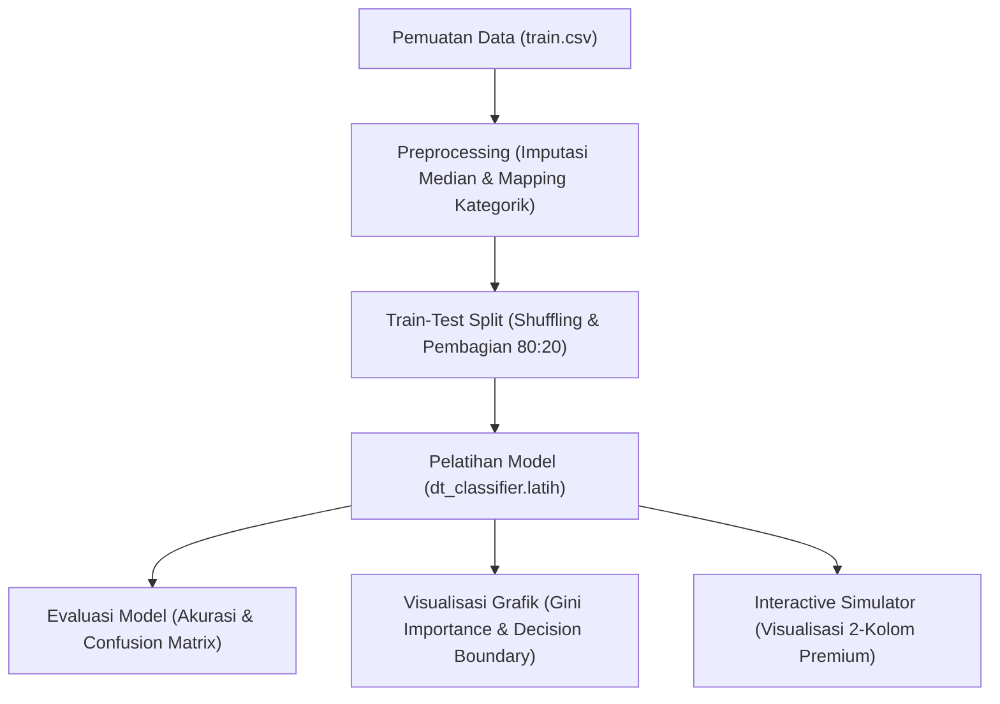

# Panduan Lengkap & Analogi Ilmiah: Titanic Decision Tree Classifier

Selamat datang di panduan komprehensif mengenai **Decision Tree Classifier** yang dibangun secara manual untuk memprediksi keselamatan penumpang kapal legendaris Titanic. Dokumen ini dirancang untuk menjelaskan seluruh aspek teoretis, praktis, matematika, alur pemrograman dari A-Z, hingga analogi dunia nyata dari model yang telah Anda buat.

---

## 1. Apa itu Decision Tree (Pohon Keputusan)?

**Decision Tree (Pohon Keputusan)** adalah algoritma pembelajaran mesin (*Machine Learning*) terawasi (*Supervised Learning*) yang digunakan untuk klasifikasi dan regresi. Algoritma ini bekerja dengan memetakan keputusan-keputusan logis menjadi struktur berbentuk **pohon terbalik** (akar di atas, daun di bawah).

> [!TIP]
> ### 🎭 Analogi Dunia Nyata: Bermain Tebak-Tebakan (20 Questions)
> Bayangkan Anda sedang bermain tebak-tebakan dengan teman Anda untuk menebak suatu karakter misterius:
> 1. Pertanyaan pertama Anda: *"Apakah dia laki-laki?"* (Ini adalah **Root Node / Akar Utama**).
> 2. Jika iya, Anda bertanya: *"Apakah usianya di atas 30 tahun?"* (Ini adalah **Branch Node / Cabang**).
> 3. Jika tidak, Anda bertanya: *"Apakah dia memakai kacamata?"*
> 4. Setelah serangkaian pertanyaan Ya/Tidak, Anda akhirnya bisa menebak: *"Karakter misterius itu adalah Tony Stark!"* (Ini adalah **Leaf Node / Daun Prediksi Akhir**).
>
> Setiap pertanyaan membantu mempersempit kemungkinan hingga Anda mencapai jawaban akhir yang paling akurat. Itulah cara kerja Decision Tree!

---

## 2. Mengapa Memilih Dataset Titanic? Apakah Masih Relevan?

Dataset Titanic adalah salah satu dataset paling ikonik dan legendaris di dunia Data Science. Dataset ini mencatat profil penumpang kapal RMS Titanic yang tenggelam pada tahun 1912, termasuk informasi kelas tiket, jenis kelamin, usia, jumlah keluarga, tarif, dan apakah mereka selamat (*Survived*).

### Mengapa Dataset ini Sangat Istimewa dan Relevan?
1. **"Hello World" untuk Klasifikasi Biner**: Prediksi hidup/mati (1/0) adalah contoh sempurna untuk memahami klasifikasi biner.
2. **Kombinasi Tipe Data yang Kaya**: Dataset ini memiliki data **kategorikal** (Sex, Embarked), **numerik kontinu** (Age, Fare), **ordinal** (Pclass), dan **diskrit** (SibSp, Parch). Ini menantang model kita untuk menangani berbagai tipe data sekaligus.
3. **Kombinasi Pola Aturan Sosial yang Jelas**: Dataset ini mencerminkan aturan sosial abad ke-20 seperti *"women and children first"* (wanita dan anak-anak didahulukan) dan hak istimewa kelas sosial (penumpang Kelas 1 lebih diprioritaskan dibanding Kelas 3). Pola ini sangat mudah divisualisasikan oleh Decision Tree.

---

## 3. Alur Kerja Sistem dari A-Z (Konsep Coding Pohon Keputusan Anda)

Mari kita bedah alur logika program Anda secara utuh dari awal pemuatan data hingga visualisasi simulator interaktif:



### Penjelasan Detail Tiap Tahap (A-Z):

1. **Pemuatan Data (`Data Loading`)**:
   Membaca file data mentah `train.csv` menggunakan pustaka Pandas (`pd.read_csv`). Kolom data awal meliputi data lengkap seperti nama, kabin, tiket, dsb.

2. **Pra-pemrosesan Data (`Preprocessing`)**:
   * **Pemangkasan Fitur**: Menghapus kolom yang tidak memiliki korelasi logis dengan keselamatan seperti `PassengerId`, `Name`, `Ticket`, dan `Cabin`.
   * **Imputasi Nilai Kosong (NaN)**: Mengisi sel kosong pada kolom `Age` dan `Fare` dengan nilai **median** (nilai tengah) dari masing-masing kolom untuk menghindari error matematika saat perhitungan.
   * **Encoding Kategorik**: Mengubah data teks menjadi angka agar bisa diproses secara matematis oleh algoritma:
     * `Sex`: `'male'` $\rightarrow 0$, `'female'` $\rightarrow 1$
     * `Embarked`: `'S'` $\rightarrow 0$, `'C'` $\rightarrow 1$, `'Q'` $\rightarrow 2$

3. **Pemisahan Data (`Train-Test Split`)**:
   * Data diacak secara acak (`random.shuffle`) agar model tidak menghafal urutan baris.
   * Dipisahkan dengan rasio **80% untuk Data Latih (`X_train`, `y_train`)** guna melatih logika pohon, dan **20% untuk Data Uji (`X_test`, `y_test`)** guna menguji performa pohon pada skenario dunia nyata.

4. **Pelatihan Model (`Model Training`)**:
   Membuat objek pohon keputusan lewat perintah `dt_classifier = DecisionTree(max_depth=7)` lalu melatihnya lewat perintah `dt_classifier.latih(X_train, y_train)`. Di sinilah pohon keputusan dibentuk secara rekursif dari atas ke bawah.

5. **Evaluasi Model (`Model Evaluation`)**:
   * **Akurasi**: Membandingkan hasil prediksi model terhadap data uji dengan label aktualnya untuk menghitung persentase kebenaran prediksi.
   * **Confusion Matrix**: Menghitung kuadran prediksi benar dan salah untuk diplot menggunakan heatmap Seaborn.

6. **Visualisasi & Simulator**:
   * **Feature Importance**: Mengukur seberapa besar peranan tiap kolom menggunakan metode **Gini Importance** tertimbang yang hasilnya divisualisasikan dalam grafik batang persentase.
   * **Decision Boundary**: Memetakan batas area keputusan model pada ruang 2D.
   * **Interactive Simulator**: Simulator interaktif yang menggabungkan input widget, gambar estetis Titanic, serta kartu prediksi keselamatan dalam layout 2-kolom yang dinamis.

---

## 4. Matematika di Balik Algoritma Decision Tree

Di bawah ini adalah penjelasan rumus matematika murni yang digunakan secara manual di dalam kode Decision Tree Anda:

### A. Rumus Gini Impurity (Ketidakmurnian Gini)
Gini Impurity digunakan untuk mengukur tingkat "kekacauan" atau keanekaragaman kelas target di suatu node.

$$\text{Gini}(T) = 1 - \sum_{i=1}^{C} (P_i)^2$$

*   $T$: Node atau kelompok data yang sedang dihitung.
*   $C$: Jumlah kelas target (pada kasus Titanic ada 2 kelas: `0 = Meninggal` dan `1 = Selamat`).
*   $P_i$: Proporsi/probabilitas kelas $i$ di dalam node tersebut.

> [!IMPORTANT]
> ### ✏️ Contoh Perhitungan Matematika Manual:
> Bayangkan sebuah kelompok berisi **10 penumpang**: **2 orang Selamat (1)** dan **8 orang Meninggal (0)**.
> *   $P_{\text{Selamat}} = \frac{2}{10} = 0.2$
> *   $P_{\text{Meninggal}} = \frac{8}{10} = 0.8$
>
> Maka nilai Gini Impurity kelompok tersebut adalah:
> $$\text{Gini} = 1 - (0.2^2 + 0.8^2)$$
> $$\text{Gini} = 1 - (0.04 + 0.64)$$
> $$\text{Gini} = 1 - 0.68 = \mathbf{0.32}$$
> Nilai `0.32` menunjukkan tingkat kekotoran data yang cukup rendah (cenderung didominasi oleh kelas Meninggal).

---

### B. Rumus Gini Index untuk Split (Weighted Child Gini)
Ketika sebuah fitur membagi data induk ($Parent$) menjadi dua cabang anak yaitu Kiri ($Left$) dan Kanan ($Right$), model menghitung total ketidakmurnian anak setelah pembagian dengan rumus rata-rata tertimbang:

$$\text{Gini}_{\text{split}} = \frac{N_{\text{Left}}}{N_{\text{Parent}}} \text{Gini}(Left) + \frac{N_{\text{Right}}}{N_{\text{Parent}}} \text{Gini}(Right)$$

*   $N_{\text{Parent}}$: Jumlah sampel sebelum di-split.
*   $N_{\text{Left}}$: Jumlah sampel yang masuk ke cabang kiri.
*   $N_{\text{Right}}$: Jumlah sampel yang masuk ke cabang kanan.
*   $\text{Gini}(Left)$ & $\text{Gini}(Right)$: Nilai Gini Impurity masing-masing cabang anak.

Algoritma akan mencari split yang menghasilkan **$\text{Gini}_{\text{split}}$ terkecil** dari semua kemungkinan fitur dan nilai pembatas (*threshold*).

---

### C. Rumus Gini Importance / Mean Decrease in Impurity (MDI)
Untuk menghitung seberapa besar pengaruh nyata dari suatu fitur $f$, kita menjumlahkan seluruh **penurunan ketidakmurnian** yang dihasilkan oleh fitur tersebut di setiap kali ia dipilih sebagai split node di seluruh pohon, ditimbang berdasarkan jumlah data yang mengalir melaluinya:

$$\text{Importance}(f) = \sum_{node \text{ split on } f} \frac{N_{node}}{N_{\text{total}}} \left( \text{Gini}(Parent) - \text{Gini}_{\text{split}} \right)$$

*   $N_{node}$: Jumlah sampel yang berada di node sebelum di-split.
*   $N_{\text{total}}$: Jumlah seluruh sampel data latih awal (misal: 712 orang).
*   $\text{Gini}(Parent) - \text{Gini}_{\text{split}}$: Selisih penurunan Gini sebelum dan setelah pembagian cabang.

> [!TIP]
> Ini adalah formula presisi yang baru saja kita pasang di metode `get_feature_importances` Anda! Formula ini membuktikan bahwa **Sex** memiliki nilai importance tertinggi karena penurunan Gini Impurity yang dihasilkannya di root node sangatlah raksasa.

---

## 5. Cara Kerja Algoritma Langkah Demi Langkah (Step-by-Step)

Bagaimana algoritma `build_tree` secara rekursif membangun pohon? Mari kita bedah jalannya proses tersebut langkah demi langkah:

1.  **Mulai pada Root Node**:
    Algoritma menerima seluruh data latih $X$ dan target $y$.
2.  **Pencarian Split Terbaik (Evaluasi Threshold)**:
    Algoritma melakukan perulangan (*looping*) untuk setiap kolom fitur:
    *   Jika kolom tersebut bertipe numerik kontinu (seperti `Age` atau `Fare`) yang memiliki ratusan nilai unik, algoritma melakukan **Sampling Threshold** (mengambil maksimal 15 batas angka saja untuk efisiensi kecepatan).
    *   Untuk setiap batas (*threshold*) tersebut, data dipisahkan menjadi dua kelompok:
        *   Kelompok Kiri: baris data yang nilainya $\le threshold$.
        *   Kelompok Kanan: baris data yang nilainya $> threshold$.
    *   Algoritma menghitung nilai $\text{Gini}_{\text{split}}$ untuk setiap pemisahan tersebut.
3.  **Pilih Pemenang**:
    Kombinasi fitur dan batas (*threshold*) yang menghasilkan nilai $\text{Gini}_{\text{split}}$ paling kecil dinobatkan sebagai pembagi terbaik.
4.  **Ciptakan Node Cabang**:
    Algoritma membuat objek `Node` baru yang menyimpan:
    *   Index fitur yang digunakan (misal: `Sex`).
    *   Nilai pembatas (misal: `0.5` yang memisahkan laki-laki dan perempuan).
5.  **Cabangkan secara Rekursif**:
    *   Algoritma memanggil fungsi `build_tree` kembali untuk data kelompok Kiri untuk membentuk cabang anak kiri (`left_child`).
    *   Algoritma memanggil fungsi `build_tree` kembali untuk data kelompok Kanan untuk membentuk cabang anak kanan (`right_child`).
6.  **Membuat Daun Akhir (Leaf Node)**:
    Jika kedalaman sudah mencapai `max_depth` (misal: tingkat ke-5), atau tidak ada data lagi untuk di-split, algoritma akan membuat `Node` khusus dengan properti `value` (berisi tebakan mayoritas kelas target di node tersebut, misal: `0` / Meninggal) dan berhenti membelah cabang tersebut.

---

## 6. Mengenal Istilah Penting dalam Struktur Pohon Keputusan

*   **Root Node (Akar Utama)**: Node paling atas di mana seluruh data latih berkumpul sebelum dibagi pertama kalinya. Node ini melambangkan split paling penting di seluruh sistem.
*   **Branch Node (Node Cabang/Internal)**: Node di tengah-tengah pohon yang mewakili pertanyaan logis Ya/Tidak berikutnya. Node ini memiliki cabang anak kiri dan kanan.
*   **Leaf Node (Daun Akhir)**: Node paling ujung di bagian bawah pohon yang tidak memiliki cabang anak lagi. Node ini menyimpan label hasil prediksi akhir (`Survived` atau `Not Survived`).
*   **Threshold (Batas Pembatas)**: Nilai batas numerik yang digunakan untuk memotong kelompok data (contoh: `Age <= 6.5` memisahkan balita dengan anak-anak/dewasa).

---

## 7. Mengapa Kita Menggunakan Confusion Matrix?

Mengukur performa model klasifikasi hanya dengan **Akurasi saja sangatlah berbahaya**. 
Misalnya, jika ada 95% penumpang yang meninggal dan hanya 5% yang selamat, sebuah model bodoh yang menebak "Semua penumpang meninggal" akan mendapatkan akurasi 95%! Namun, model tersebut gagal mendeteksi orang yang selamat sama sekali.

**Confusion Matrix** memecah performa prediksi model secara jujur ke dalam 4 kuadran:

| | **Prediksi Meninggal (0)** | **Prediksi Selamat (1)** |
| --- | --- | --- |
| **Aktual Meninggal (0)** | **True Negative (TN)** <br> *(Meninggal diprediksi Meninggal)* | **False Positive (FP)** <br> *(Meninggal diprediksi Selamat)* |
| **Aktual Selamat (1)** | **False Negative (FN)** <br> *(Selamat diprediksi Meninggal)* | **True Positive (TP)** <br> *(Selamat diprediksi Selamat)* |

### Mengapa ini Sangat Penting di Titanic?
Dalam evakuasi darurat, **False Negative (FN)** sangat fatal: memprediksi seorang penumpang akan selamat, padahal aslinya ia membutuhkan bantuan segera dan akhirnya meninggal. Confusion Matrix membantu kita memantau presisi (*Precision*) dan kepekaan (*Recall*) model agar seimbang.

---

## 8. Mengapa Memilih `max_depth = 5` atau `7`? (Konsep Overfitting)

**`max_depth`** adalah batas maksimum kedalaman cabang pohon keputusan Anda. Memilih nilai kedalaman adalah seni menjaga keseimbangan antara **Overfitting** dan **Underfitting**.

| Kedalaman (`max_depth`) | Karakteristik Model | Risiko |
| --- | --- | --- |
| **Terlalu Rendah (1 - 2)** | Pohon terlalu sederhana (hanya bertanya tentang Sex) | **Underfitting**: Gagal mempelajari pola data penting. |
| **Sangat Pas (5 - 7)** | Memiliki kedalaman yang cukup untuk memahami kombinasi logis (Sex + Pclass + Age) | **Optimal**: Akurasi pada data latih dan data uji seimbang. |
| **Terlalu Tinggi (> 10)** | Pohon sangat dalam hingga mencabangkan data perorangan | **Overfitting**: Model menghafal data latihan secara detail tapi gagal saat diuji data baru. |

> [!WARNING]
> ### 🎓 Analogi Mahasiswa yang Belajar Ujian
> * **Mahasiswa Underfitting**: Hanya membaca judul buku saja. Saat ujian, ia kebingungan dan nilainya buruk.
> * **Mahasiswa Overfitting (Menghafal)**: Menghafal seluruh soal latihan kata demi kata, termasuk titik komanya. Saat ujian sesungguhnya tiba dengan soal yang angkanya sedikit diganti, ia **gagal total** karena ia tidak memahami konsep dasarnya, melainkan hanya menghafal mati soal latihan.
> * **Mahasiswa Optimal**: Memahami pola dan konsep dasar rumus. Saat disodorkan soal baru dengan angka berbeda, ia bisa mengerjakannya dengan sangat sukses.
>
> Membatasi `max_depth` pada angka **5** atau **7** memaksa pohon keputusan kita untuk menjadi "Mahasiswa Optimal"—ia mempelajari pola umum penumpang Titanic (misal: *"perempuan di Kelas 1 umumnya selamat"*), bukan menghafal nama penumpang secara perorangan!

---

## 9. Visualisasi Decision Boundary (Batas Keputusan)

Pada Cell 12, terdapat visualisasi grafik 2D yang menakjubkan bernama **Decision Boundary (Batas Keputusan)** untuk sumbu **Age** (Usia) vs **Fare** (Tarif). 

### Apa itu Decision Boundary?
Decision Boundary adalah garis pembatas visual yang memisahkan area prediksi model ke dalam wilayah-wilayah kelas keputusan yang berbeda. 

```text
Tarif (Fare)
   ▲
   │    ┌────────────────────────┐
   │    │      Kawasan Biru      │
   │    │  (Prediksi: SURVIVED)  │
   │    │                        │
   │    ├────────────────────────┤   ◄─── Decision Boundary
   │    │     Kawasan Abu-abu    │
   │    │(Prediksi: NOT SURVIVED)│
   │    └────────────────────────┘
   └────────────────────────────────►  Usia (Age)
```

### Bagaimana Cara Kode Anda Menggambarnya?
1. **Membuat Grid 2D (Meshgrid)**:
   Kode membuat ribuan titik koordinat imajiner halus (`xx` dan `yy`) yang menutupi seluruh rentang grafik Usia (misal: 0 sampai 80) dan Tarif (misal: 0 sampai 500).
2. **Prediksi Setiap Titik Koordinat**:
   Model menelusuri satu demi satu ribuan titik koordinat imajiner tersebut dan memprediksinya menggunakan pohon keputusan. Kelompok penumpang lainnya disetel default (misal: Pclass=3, Sex=Laki-laki) untuk menciptakan area batas yang konstan.
3. **Menggambar Area Warna (`plt.contourf`)**:
   Titik-titik yang diprediksi *Selamat* diwarnai sebagai **Kawasan Biru Lembut**, sedangkan yang diprediksi *Tidak Selamat* diwarnai sebagai **Kawasan Abu-abu/Putih**.
4. **Plot Titik Aktual Penumpang**:
   Menumpuk titik-titik data penumpang asli di atas kawasan warna tersebut:
   *   Titik **Biru Tua**: Penumpang aktual yang Selamat.
   *   Titik **Abu-abu Tua**: Penumpang aktual yang Meninggal.

### Cara Membaca & Mempresentasikan Grafiknya:
*   Jika titik penumpang aktual berwarna **Biru Tua** jatuh di dalam kawasan berwarna **Biru Lembut**, artinya model Anda berhasil memprediksi penumpang tersebut dengan **sangat tepat**.
*   Batas garis pemisah antara kawasan Biru Lembut dan Abu-abu Lembut itulah yang disebut **Decision Boundary**. Garis pembatas ini terlihat berbentuk kotak-kotak bertingkat siku-siku (ortogonal) yang merupakan ciri khas unik dari algoritma Decision Tree karena ia membelah data secara tegak lurus berdasarkan kondisi Ya/Tidak ($\le$ atau $>$).
